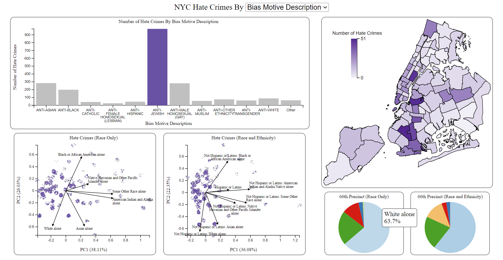

# Hate Crimes Dashboard

This is an interactive dashboard that displays NYC hate crime data combined with NYC precinct population data. The dashboard was built using Flask and D3.js and contains a bar chart, two biplots, a map, and two pie charts.

## Features

* The dropdown at the top can be used to change the currently used variable on the bar chart.

* Clicking on a bar will highlight corresponding points on the biplot, as well as color the map based on the number of hate crimes in the precinct corresponding to the clicked bar. The currently selected bar must be deselected before clicking on another bar.

* Clicking on a precinct will show its demographics using pie charts.

* The bars, precincts, and pie slices can all be hovered over to display more information.

## Datasets

* NYPD Hate Crimes: https://data.cityofnewyork.us/Public-Safety/NYPD-Hate-Crimes/bqiq-cu78

    * This is a dataset containing confirmed hate crime incidents in NYC.

* NYPD Precinct Demographics: https://johnkeefe.net/nyc-police-precinct-and-census-data (nyc_precinct_2020pop.csv)

    * This is a dataset containing racial and ethnic demographic information for each NYPD precinct.

## Justification of Data

* By itself, the NYPD hate crimes data is interesting because there may be patterns in where the hate crimes occur, when they occur, what motives they occur for, and whether arrests are made for them.

* By itself, the NYPD precinct demographics data is interesting because there may be patterns in the racial and ethnic makeup of each precinct.

* Together, the merged dataset is interesting because there may be correlations between the type of hate crime and the racial and ethnic makeup of the precinct where it occurred, as well as correlations between the number of hate crimes occurring in a precinct and the makeup of that precinct.

## Data Attributes (Condensed)

|     Attribute    |     Description    |     Number of Values    |
|---|---|---|
|     Full Complaint ID    |     Identifier for each hate crimes incident    |     2058 unique values    |
|     Complaint Year Number    |     Year in which incident occurred    |     5 unique values    |
|     Month Number    |     Month in which incident occurred    |     12 unique values    |
|     Record Create Date    |     Date report was filed    |     1076 unique values    |
|     Precinct    |     NYPD Precinct in which incident occurred    |     77 unique values    |
|     Patrol Borough Name    |     NYPD Patrol Borough in which incident occurred    |     8 unique values    |
|     County    |     County in which incident occurred    |     5 unique values    |
|     Law Code Category Description    |     Category of offense    |     4 unique values    |
|     Offense Description    |     A description of the offense    |     22 unique values    |
|     PD Code Description    |     The NYPD description of the offense    |     69 unique values    |
|     Bias Motive Description    |     NYPD category of hate crime or bias type    |     27 unique values    |
|     Offense Category    |     General categorization of hate crime type    |     8 unique values    |
|     Arrest Date    |     Date arrest was made (if arrest happened)    |     500 unique values    |
|     Arrest Id    |     Identifier for arrest (if made)    |     894 unique values    |
|     Total:    |     Total population    |     N/A    |
|     Total: Population of one race:    |     Total population that identifies with only one race    |     N/A    |
|     Total: Population of two or more races:    |     Total population that identifies with two or more races    |     N/A    |
|     Total: Hispanic or Latino    |     Total population that identifies as Hispanic or Latino    |     N/A    |
|     Total: Not Hispanic or Latino:    |     Total population that does not identify as Hispanic or Latino    |     N/A    |
|     Total: Not Hispanic or Latino: Population of one race:    |     Total population that does not identify as Hispanic or Latino   but identifies with only one race    |     N/A    |
|     Total: Not Hispanic or Latino: Population of two or more races:    |     Total population that does not identify as Hispanic or Latino   but identifies with two or more races    |     N/A    |

## How to Run

1. Clone the repository.

2. Run [app.py](app.py) to start the Flask server.

3. Go to http://localhost:8000/ to view the dashboard.

Note: The datasets were merged using [mergedata.py](data/step1/mergedata.py). Then, [dashboard.py](data/step2/dashboard.py) exported all of the required data for the dashboard to [dashboard.json](static/dashboard.json).
